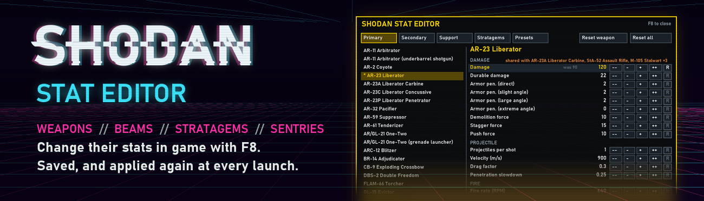
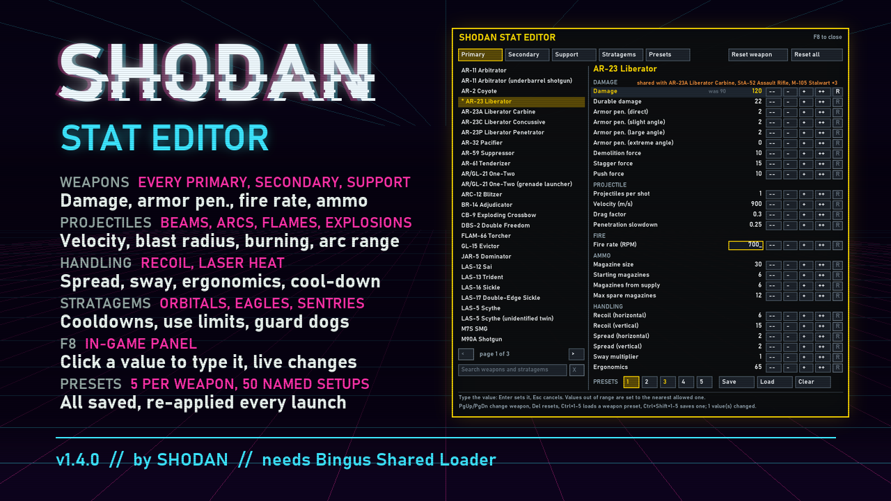

# SHODAN Stat Editor

An in-game panel for **Helldivers 2** that changes weapon and stratagem stats while you play.
Press **F8**, pick a weapon or stratagem, and change its numbers. Changes apply at once, are
saved, and are applied again automatically every time the game starts. Keep setups as presets:
5 per weapon, and up to 50 named ones for everything you have changed.

**[Download the latest release](../../releases/latest)** · Requires **Bingus Shared Loader** (v15 or newer)



## What you can change

**Weapons**: every primary, secondary and support weapon

| Section | Stats |
|---|---|
| Damage | Damage, durable damage, armor penetration (direct, slight, large and extreme angle), demolition force, stagger force, push force (from the bullet, beam, flame, arc or melee strike) |
| Projectile | Projectiles per shot, velocity, drag factor, penetration slowdown |
| Explosion | Inner, outer and shockwave radius of the blast (grenade launchers and pistols, EATs, recoilless, Autocannon, Eruptor and every other weapon with explosive rounds); the Breaching Hammer's explosion also has its full damage set |
| Arc | Range, chain length, chain split (Arc Thrower, Blitzer, K-9 Guard Dog, Tesla Tower) |
| Burning / Gas | How much fire or gas each hit applies (flamethrowers, Coyote, Hyena, incendiary shotguns, lasers, EAT-700, gas weapons); burn / gas damage, armor penetration and duration |
| Fire | Fire rate (every fire mode the weapon has) |
| Ammo | Magazine size, starting magazines, magazines from supply, max spare magazines (or rounds, for weapons loaded by the round) |
| Handling | Recoil (horizontal, vertical), spread (horizontal, vertical), sway, ergonomics |
| Heat | Overheat threshold, heat per shot / per second, cool-down time (lasers, Quasar Cannon), heatsinks |

Beam weapons (Scythe, Dagger, Trident, Laser Cannon, Meltagun) get their damage from their beam,
flame weapons (Flamethrower, Torcher, Crisper, Cremator, Sterilizer) from their spray, arc weapons
from their arc and melee weapons (Breaching Hammer, Machete, Saber, ...) from their strike; all
are fully supported. A flamer's **Damage** is what each flame hit does.

**Burning and gas are shared.** "Burning applied per hit" belongs to the weapon; the **Burning**
(or **Gas**) section below it is the effect itself, shared by every source of it in the game,
enemies' fire included. To make one weapon burn harder, raise its own values.

**Cool-down time** is shown in seconds: how long a full heat bar takes to cool to zero. Setting it
sets the cooling rate, so raising the overheat threshold also lengthens it. The Quasar Cannon's
recharge is its "cool-down time after overheat".

**Stratagems**

| Stratagem | Stats |
|---|---|
| All | Cooldown, and uses where limited |
| Eagles | Uses per rearm, Eagle rearm time |
| Orbital and Eagle strikes | For every projectile and blast they use: velocity, inner / outer / shockwave radius, and the full damage set above |
| Orbital Laser | Duration, tracking speed, search radius, damage tick |
| Guard Dogs (AR-23, Rover, Dog Breath, Hot Dog, K-9) | The drone's health, spotting range and target search interval, and the gun it carries, stat for stat like a weapon |
| Sentries and emplacements (all ten sentries, HMG and Anti-Tank Emplacements, Grenadier Battlement) | Cooldown, health, spotting range, target search interval, turret turn speed, and their weapon stat for stat (the Tesla Tower's arc included) |

How far a Guard Dog flies from you is decided by its behaviour in the game code, not by the data
the panel edits, so it can't be changed. The AR-23 dog's bullet is the Liberator Penetrator's and
the Hot Dog's flame damage is the Torcher's; the panel notes values that change together.

## Install

1. Install **Bingus Shared Loader** (v15 or newer).
2. Download `SHODAN-Stat-Editor-v1.4.1.zip` from the [releases page](../../releases/latest).
3. Install the zip with your Helldivers 2 mod manager, like any other mod package.

## Use

Press **F8** in game to open or close the panel. The mouse works wherever the game shows a
cursor; the keyboard works everywhere:

| Key | Action |
|---|---|
| Up / Down | Choose a stat |
| Left / Right | Change it (hold Shift for bigger steps) |
| Enter, or click a value | Type the value (Enter sets it, Esc cancels) |
| PgUp / PgDn | Previous / next weapon |
| Ctrl+F | Search (or click the box under the list) |
| Del | Reset the stat to the game's value |
| Ctrl+1–5 / Ctrl+Shift+1–5 | Load / save a weapon preset |

**Typing values.** Click a number (or press Enter on a stat) and type: digits, and "." or ","
for decimals. Enter sets it, Esc cancels, and clicking elsewhere also sets it. A value outside
what the stat can take is set to the nearest allowed one, and the panel says so.

Every change is saved to

```
%LOCALAPPDATA%\CowboyBingus\Helldivers2\StatEditor\config.txt
```

and applied again on every start, a few seconds after launch (on the title screen). The hotkey
can be changed in that file (for example `hotkey F7`). Delete a line, or the whole file, to go
back to the game's values.

## Search

Click the box under the weapon list (or press Ctrl+F) and type: the list shows the weapons and
stratagems of every tab whose name holds all the words typed ("orb las" finds the Orbital
Laser). Enter keeps the results; Esc or **X** clears the search. The game also receives the keys
you type, so search from a menu.

## Presets

**Weapon presets.** Every weapon and stratagem has 5. Use the PRESETS strip under its stats:
pick a number, then **Save** (its current values), **Load** or **Clear**. Numbers in gold hold a
preset. Loading one sets the weapon exactly as saved; anything the preset doesn't name goes back
to the game's value.

**Full presets.** Up to 50, on the **Presets** tab, each with a name you choose and every change
you have made.

- **+ New preset** saves your current changes as one, then you type its name (Enter keeps it,
  Esc cancels).
- **Load** replaces all current changes with the preset. **Save current changes here**,
  **Rename** and **Delete** work on the chosen one; overwriting and deleting ask twice.
- Keyboard on that tab: Up/Down choose, Enter loads, Insert makes a new one, Shift+Insert saves
  into the chosen one, F2 renames, Del deletes.
- The game also receives the keys you type, so name presets from a menu (pause menu, ship).

Presets are saved next to config.txt, as `weapon_presets.txt` and `preset_01.txt` …
`preset_50.txt`. A full preset file can be copied into another player's `StatEditor` folder to
share the whole setup.

## Good to know

- **Shared values.** Some weapons fire the same projectile or share its damage values (for
  example the Liberator, Liberator Carbine, StA-52 and Stalwart). The panel names the weapons
  that change along with the one you edit.
- **Variants.** Some weapons exist more than once in the game's data (a mounted copy, an
  underbarrel attachment). The list labels each one, and the panel says which copy
  you are editing.
- **Barrages** can use different shells for different rounds; the section names say which rounds
  a value belongs to. Long lists scroll: Up/Down follow the chosen stat, or use the buttons under
  the list.
- **Magazine attachments** (for example on the MP-98 Knight or SG-225 Breaker) set magazine
  counts themselves when one is fitted.
- The **armory** still shows the game's own numbers; the changes apply in play.
- **In multiplayer** your changes exist only in your game.
- **Other mods** that change the same stats will fight over them; use one or the other.
- **Nothing on disk is modified.** The mod changes the game's settings in memory while it runs.

## Reporting problems

Open an [issue](../../issues) and attach the log:

```
%LOCALAPPDATA%\CowboyBingus\Helldivers2\Logs\SHODANStatEditor.log
```

The log lists the tables the mod found, every stratagem it listed, and anything it could not
match, which is usually enough to find the cause.

## Credits

- **Bingus Shared Loader** by CowboyBingus, which runs the mod.
- **HD2Runtime** by Skyeshade, whose weapon and stratagem catalogs name the weapons and map
  every strike to its projectiles, blasts and damage.
- **[Filediver](https://github.com/xypwn/filediver)** and the **[helldivers.io](https://helldivers.io/)**
  data dump by shalzuth, for the game's data layouts.
- **DiverKit** and **HD2 HUD Plus**, which showed where the game's UI font lives.

## License

Public domain ([The Unlicense](LICENSE)). Use, change, share or sell it however you like; no
credit needed.

SHODAN Stat Editor is not affiliated with or endorsed by Arrowhead Game Studios or Sony
Interactive Entertainment.
